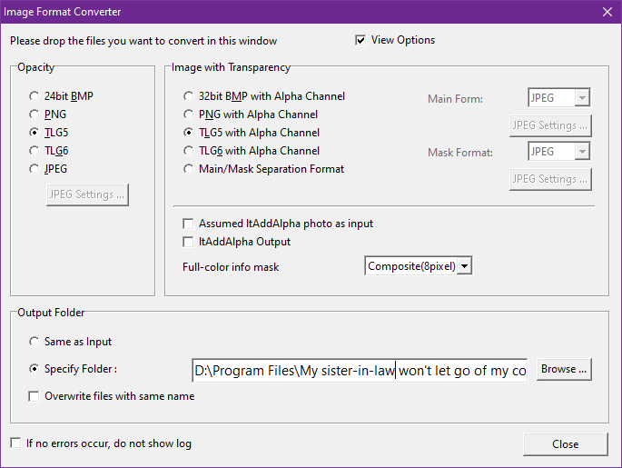
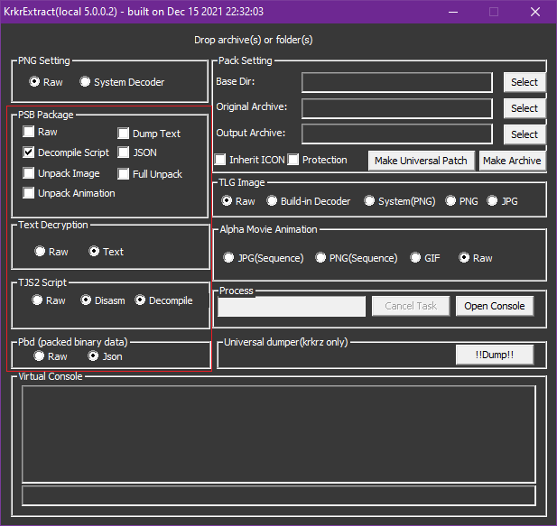

# KiriKiri Engine Translation Tools

KiriKiri ([吉里吉里](https://ja.wikipedia.org/wiki/%E5%90%89%E9%87%8C%E5%90%89%E9%87%8C2 "KiriKiri wiki (JP)")) adalah scripting engine yang dikembangkan oleh developer asal Jepang bernama "w.dee" yang pertama kali dirilis pada tahun 1998. Sering digunakan dengan framework KAG (KiriKiri Adventure Game System) sebagai game engine Visual Novel.

KiriKiri bisa dikatakan sebagai pengganti [NScripter](https://nscripter.com/ "NScripter official page") yang sudah usang. KiriKiri sudah digunakan di berbagai game Visual Novel terkenal seperti [Fate/stay night](https://en.wikipedia.org/wiki/Fate/stay_night "Fate/stay night") dan [Fate/hollow ataraxia](https://en.wikipedia.org/wiki/Fate/hollow_ataraxia "Fate/hollow ataraxia") serta game Doujin sejuta umat [NEKOPARA](https://en.wikipedia.org/wiki/Nekopara "NEKOPARA") dengan menggunakan versi kustom KiriKiri.

KiriKiri sudah lama tidak ada update, tapi untungnya masih ada fork yang aktif dikembangkan yang dikenal dengan nama [KiriKiri Z (吉里吉里Z)](https://krkrz.github.io/ "KiriKiri Z official page").

Dokumentasi KiriKiri:

- [KAG System reference](https://krkrz.github.io/krkr2doc/kag3doc/contents/index.html)
- [TJS2 reference](https://krkrz.github.io/krkr2doc/tjs2doc/contents/index.html)
- [KiriKiri2 reference](https://krkrz.github.io/krkr2doc/kr2doc/contents/index.html)

Referensi:

- <https://en.wikipedia.org/wiki/List_of_visual_novel_engines#KiriKiri>
- <https://lemmasoft.renai.us/forums/viewtopic.php?t=21798>

## Daftar Tools

### KiriKiri/KAG Engine

Engine KiriKiri/KAG yang digunakan untuk membuat game Visual Novel. Berisi semua tool yang berhubungan dengan pengembangan game Visual Novel di KiriKiri engine.

Maaf, kami belum bisa menjelaskan setiap komponen dari KiriKiri/KAG engine karena belum pernah menggunakannya dan juga dokumentasinya menggunakan bahasa Jepang (ada juga yang berbahasa Inggris tapi hanya beberapa bagian saja).

Kalian bisa dapatkan KiriKiri/KAG engine di: <https://sourceforge.net/projects/kirikirikag/>

Saat ini kami hanya menggunakan 2 tool dari KiriKiri/KAG, yaitu `krkrsign` dan `krkrtpc` (jika sudah kalian download, kalian bisa temukan tool tersebut di `kirikiri2/tools`).

Arsip: [KrkrDEV_232r2EN.7z](./KrkrDEV_232r2EN.7z "KrkrDEV_232r2EN.7z")

#### kirikiri2/tools/krkrtpc

`krkrtpc` kami gunakan untuk convert file `.png` yang sudah kami edit (lihat bagian [tlg2png](#tlg2png "Lompat ke bagian tlg2png")) kembali ke format asli yang digunakan KiriKiri engine yaitu `.tlg`.

Pemakaiannya mudah, tinggal drag and drop file `.png` ke `krkrtpc`, jika kalian ingin convert lebih dari satu file tinggal pilih semua file itu dan drag and drop ke `krkrtpc`.



### KirikiriTools

[KirikiriTools](https://github.com/arcusmaximus/KirikiriTools "KirikiriTools") memiliki 3 tool yang sangat membantu sekali untuk unpack/decompile ataupun bypass file game dari Kirikiri engine. KirikiriTools berbasis CLI sehingga kamu harus tahu basic mengeksekusi aplikasi melalui CMD.

KirikiriTools bisa kalian download di bagian [KirikiriTools Releases](https://github.com/arcusmaximus/KirikiriTools/releases "KirikiriTools Releases").

- KirikiriDescrambler

  Kirikiri engine memiliki file script yaitu `.ks` (scenario/file cerita VN) dan `.tjs` (script inti Kirikiri) yang dapat ditemukan di file `data.xp3` yang sudah di-unpack. Beberapa developer biasanya meng-encrypt file tersebut sehingga tidak dapat dibaca.  
  KirikiriDescrambler digunakan untuk decrypt file tersebut agar bisa dibaca dan diedit.

  Cara Penggunaan:

  ```cmd
  KirikiriDescrambler <file/folder>
  ```

- KirikiriUnencryptedArchive

  Biasanya developer VN menggunakan pengecekan enkripsi file `.xp3` agar mendeteksi apakah enkripsi file `.xp3` sama dengan milik game, jika tidak maka game tidak akan berjalan.  
  KirikiriUnencryptedArchive digunakan untuk bypass hal ini. Jadi tidak perlu susah mereplika enkripsi gamenya, contohnya saat membuat arsip `.xp3` di aplikasi [GARbro](https://github.com/morkt/GARbro "GARbro").

  Cara penggunaannya cukup mudah, tinggal taruh file `version.dll` di folder instalasi gamenya.
- Xp3Pack

  Xp3Pack digunakan untuk membuat arsip `.xp3` yang tidak terenkripsi dan biasanya digunakan bersamaan KirikiriUnencryptedArchive.

  Cara penggunaannya mudah, tinggal arahkan folder mana yang akan di-pack:

  ```cmd
  Xp3Pack <folder>
  ```

Arsip: [KirikiriTools.7z](./KirikiriTools.7z "Download KirikiriTools.7z")

### KrkrExtract

  [KrkrExtract](https://github.com/xmoezzz/KrkrExtract "KrkrExtract") digunakan untuk unpack dan pack file `.xp3` krkr2 and krkrz (32 & 64 bit). Setelah saya coba, fitur pack ternyata tidak berjalan, hanya fitur unpack yang masih berjalan dengan normal.

  Kalian bisa download KrkrExtract di bagian [KrkrExtract Releases](https://github.com/xmoezzz/KrkrExtract/releases "KrkrExtract"). Download semua file (`KrkrExtract.Core.dll`, `KrkrExtract.Lite.exe`, `KrkrExtract.UI.Lite.dll`) agar aplikasinya dapat berjalan.

  Cara Penggunaan:

- Pindah semua file yang sudah di download tadi ke folder instalasi game.
- Jalankan `KrkrExtract.Lite.exe`.
- Drag dan drop file `.exe` game nya ke KrkrExtract, secara otomatis game nya akan berjalan.
- Kami memakai configurasi seperti ini jika ingin mengekstrak file `.xp3` yang berisi script dan skenario game (biasanya di `data.xp3`):

  

- Drag dan drop file `.xp3` yang ingin kamu ekstrak ke KrkrExtract. Hasil ekstrak akan ada di folder `KrkrExtract_Output` di direktori game kamu.
- Untuk ekstrak file `.xp3` yang berisi cg/gambar (biasanya `syscg.xp3`, `evecg.xp3`) dan audio (`bgm.xp3`, `cv.xp3`, `se.xp3`), kami biarkan config nya apa adanya. Hasil ekstrak file `.xp3` yang berisi gambar akan berupa file `.tlg` dan `.xp3` audio biasanya `.ogg`.  
Untuk convert file `.tlg` ke format lain, ada di bagian [tlg2png](#tlg2png "Lompat ke bagian tlg2png").

Arsip: [KrkrExtract.7z](./KrkrExtract.7z "KrkrExtract.7z")

### tlg2png

[tlg2png](https://github.com/vn-tools/tlg2png "tlg2png") adalah tool untuk convert file `.tlg` yang digunakan Kirikiri engine ke format yang lebih umum yaitu `.png` agar bisa diedit.

Kamu bisa tlg2png di [tlg2png Releases](https://github.com/vn-tools/tlg2png/releases "Releases").

Cara penggunaan:

```cmd
tlg2png <file_input> <file_output>
```

Jika kalian ingin convert file `.tlg` ke `.png` secara batch (folder), kami sudah membuat script bantuan yang bisa kalian gunakan sehingga tidak buang-buang waktu dengan convert satu persatu file `.tlg`.  
Script nya yaitu `tlg2png-batch`, cara penggunaanya sangat mudah tapi pertama kalian harus pastikan taruh script ini bersamaan dengan `tlg2png.exe`, setelah itu:

```cmd
tlg2png-batch <folder_input> <overwrite[no]>
```

Opsi `overwrite` menimpa file yang dulu sudah di-convert, jika kalian tidak ingin menimpa file tersebut (skip), tinggal kasih parameter `overwrite` dengan nilai `no`.  
Hasil convert akan ada di folder `folder_input_png`.

Arsip: [tlg2png-v10-w32.7z](./tlg2png-v10-w32.7z "tlg2png-v10-w32.7z")
